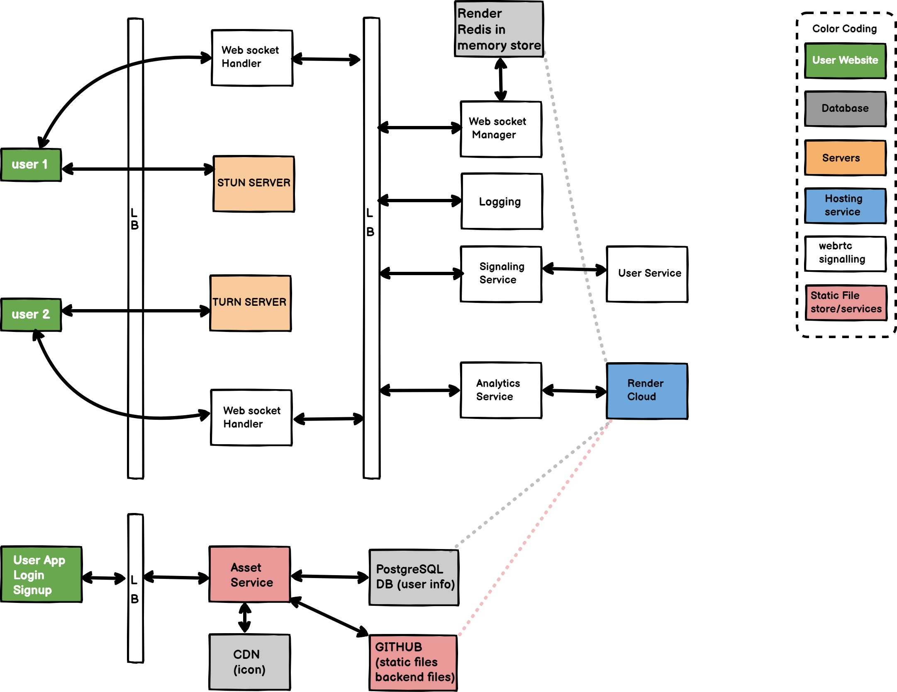

# Video-Conferencing-Web-App

### Peer to Peer video calling connection with screen sharing 

## Table of Contents
- [Project objective](#Project)
- [Complexity](#Distinctiveness)
- [What’s contained in each file I created.](#What)
- [LIVE DEMO](#Live)
- [Technology](#Technology)
- [Key Features](#Key)
- [How to run application locally ?](#How)
- [System Architecture](#architecture)


<div id="Live"/>

### [Live Demo link](https://connect-rtc.onrender.com/)


<div id="Project"/>

### Project Objective:
Design an intuitive and user-centric video conferencing web application that provides seamless,
high-quality virtual communication experiences, fosters collaboration, and ensures accessibility 
across devices and platforms. The objective is to create a user-friendly interface, optimize audio 
and video performance, integrate essential features such as screen sharing , prioritize 
data security and privacy, and deliver a reliable tool that enhances remote communication for 
both personal and professional users.

##### Functional Requirements :

        The system must support 1-to-1 calls
        Calls can be audio or video or screen sharing 
        User signup
        Responsive Web Page design


<div id="Distinctiveness"/>

### Complexity
 This projects is distinctive and complex due to the real-time nature of the communication, cross-platform compatibility considerations, network and firewall traversal challenges, security requirements, scalability concerns, and integration with existing systems. Successful implementation requires expertise in WebRTC standards, web development, network protocols, and security practices. The WebRTC Protocol is a collection of other technologies like signaling, connecting, securing, communicating. I will explain complexity in establishing bidirectional connection of audio/video channels between local and remote users.

 1. Signaling - Signaling is used to establish connections between local user and remote users. This connection is done by SDP (Session Description Protocol). This protocol share information and capabilities of local and remote users like public IP and ports that agent is reachable on, the number of audio and video tracks the agent wishes to send, the audio and video codecs each agent supports(VP8), The values used while securing (certificate fingerprint). Signaling use third party servers to communicate or existing infrastructure to facilitate trading of SDPs between the proper clients.

 2. Connecting and NAT Traversal with STUN servers - Local and remote have each others SDP's but still connection is not happen. This is because of users are behind NAT (Network Address Translation) or firewall.To make this connection happen, WebRTC uses another established technology called ICE (Interactive Connectivity Establishment). STUN server is useful because it allows the programmatic creation of NAT Mappings. STUN not only gives you the ability to create a mapping, but also gives you the details so that you can share them with others, so they can send traffic back to you via the mapping you just created. This is called as trickling ICE. 

3. Securing the transport layer with DTLS and SRTP - Now that we have bi-directional communication (via ICE), we need to make our communication secure! This is done through two more protocols that also pre-date WebRTC; DTLS (Datagram Transport Layer Security) and SRTP (Secure Real-Time Transport Protocol). The first protocol, DTLS, is simply TLS over UDP (TLS is the cryptographic protocol used to secure communication over HTTPS). The second protocol, SRTP, is used to ensure encryption of RTP (Real-time Transport Protocol) data packets.First, WebRTC connects by doing a DTLS handshake over the connection established by ICE. Unlike HTTPS, WebRTC doesn’t use a central authority for certificates. It simply asserts that the certificate exchanged via DTLS matches the fingerprint shared via signaling. This DTLS connection is then used for DataChannel messages. Next, WebRTC uses the RTP protocol, secured using SRTP, for audio/video transmission. We initialize our SRTP session by extracting the keys from the negotiated DTLS session. Now bidirectional connections is done between local and remote users.


<div id="What"/>

### What’s contained in each file I created.
1. [videoconferencing/views.py](videoconferencing/views.py) file contains function based views for login, signup, logout,  create new channel, video call page.
2. [videoconferencing/models.py](videoconferencing/models.py) file contains model classes for users.
3. [videoconferencing/templates](videoconferencing/templates) folder contains 5 HTML files for hosting video call, create channel, home page contain headers, footers, and navigation panel. All pages use template inheritance in a project.
4. [videoconferencing/static](videoconferencing/static) folder contain images folder, styling files folder, JavaScript files folder
5. [js/webrtc.js](videoconferencing/static/videoconferencing/js/webrtc.js) file contain all async functions for getting media devices, sending SDP's , ICE candidates, and adding tracks to the channel. This file also contains fetch API's for getting user information from database.
6. [js/forgotpassword.js](videoconferencing/static/videoconferencing/js/forgotpassword.js) file contain event listeners and fetch API for storing new password to the database.
7. [videoconferencing/consumers.py](videoconferencing/consumers.py)this file is similar to views.py, which contains asynchronous functions for channel.  
8. [videoconferencing/routing.py](videoconferencing/routing.py)this file route for websocket connection.


<div id="Technology"/>

### Technology:
1. WebRTC (agora)
2. Python (Django)
3. Database (PostgreSQL)
4. HTML, JavaScript, CSS, Bootstrap 
5. Host server on [render](https://render.com/)

<div id="Key"/>

### Key Features:
1. **Video Calling:** The application allows users to initiate video calls with other participants in real time. It leverages the Agora RTC SDK to establish reliable and high-quality video communication.

2. **User Signup:** Users can create new accounts by registering their credentials, including username, email address, and password. The signup process ensures password matching functionality to validate accurate password input.

3. **Forget Password:** If users forget their passwords, they can utilize the "Forget Password" feature to initiate a password reset process. This typically involves sending a password reset link or verification code to the user's registered email address.

4. **Mic Mute/Unmute:** During a video call, participants can easily control their microphone's audio input by toggling the mic mute/unmute functionality. This allows users to silence or enable their audio as desired.

5. **Camera Mute/Unmute:** Participants can control their camera's video feed during a video call. By using the camera mute/unmute functionality, users can turn off or resume their video streaming according to their preferences.

6. **End Call Functionality:** Users have the ability to terminate ongoing video calls using the end call feature. This action disconnects the call and returns participants to the application's main interface.

7. **Responsive Web Application:** The application is designed to be responsive, ensuring optimal user experience across a variety of devices and screen sizes. It automatically adapts its layout and functionality to provide a seamless video calling experience on desktops, laptops, tablets, and mobile devices.

8. **Screen Sharing:**User can share any window with remote peer with audio.

9. **Switch to back camera**:Mobile users can able to switch to back camera.


<div id="How"/>

### How to run application locally ?
#### step 1 - Clone repo
```
 git clone https://github.com/ShubhamOulkar/Video-Conferencing-Web-App.git
```
#### step 2 - Create/activate virtual environment in your current directory

#### step 3 - Install requirements
```
pip install -r requirements.txt
```
#### step 4 - change directory to mainfolders
```
cd main
```
### step 5 - open main folder and create .env file add following varibles
#### method 1
```
REDIS_URL={create redis stack acount https://app.redislabs.com/#/ and add free redis server url here}
EMAIL_HOST_USER={your email address}
EMAIL_HOST_PASSWORD={gmail app password}
TWILIO_TOKRN={create twilio account and add token here, this is for TURN server}
TWILIO_SID={create twilio account and add SID here, this is for TURN server}


<!-- Adding external redis url will slow down our signalling process I dont recommend this only use when your hosting environment dont have internal redis server-->
```

```
<!-- Don't forget to change settings.py file as follows -->

CHANNEL_LAYERS = {
    "default": {
        "BACKEND": "channels_redis.core.RedisChannelLayer",
        "CONFIG": {
            "hosts": [env('REDIS_URL')], 
        },
    },
}
```

#### method 2: If redis is available on machine then change following hosts address  and port. Default port is 6379.
```
CHANNEL_LAYERS = {
    "default": {
        "BACKEND": "channels_redis.core.RedisChannelLayer",
        "CONFIG": {
            "hosts": [('ADD-YOUR-REDIS-ADDRESS', REDIS-PORT)], 
        },
    },
}
```

#### method 3: if you dont have above options then just use django-channels in memory channel_layer as follows.  This layer can be helpful in Testing or for local-development purposes:

```
CHANNEL_LAYERS = {
    "default": {
        "BACKEND": "channels.layers.InMemoryChannelLayer"
    }
}
```

#### step 6 - run following commands for migrations in terminal
```
python manage.py makemigrations
```
```
python manage.py migrate
```

#### step 7 - Start server
```
python manage.py runserver
```

<div id="architecture"/>




